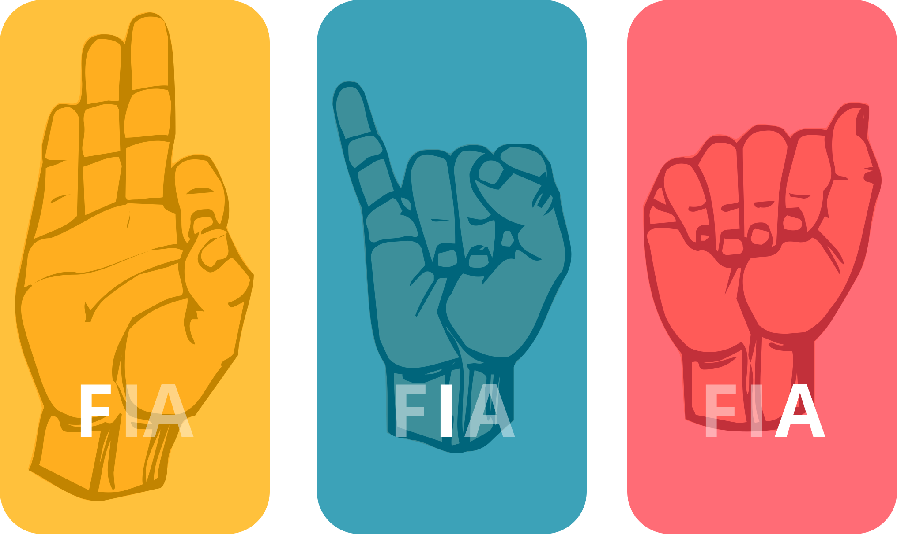

# SignHelper
#### Progetto per il corso di Fondamenti di Intelligenza Artificiale
Lo scopo di questo progetto consiste nel creare una intelligenza artificiale in grado di comprendere il linguaggio dei segni americano (ASL).

### Composizione repository:
Il notebook con il modello è disponibile nel file notebook.ipynb, il dataset è contenuto già nella repository.
La relazione e la presentazione sono entrambi nella repository con nome "relazione_FIA.pdf" e "Presentazione.pdf"
